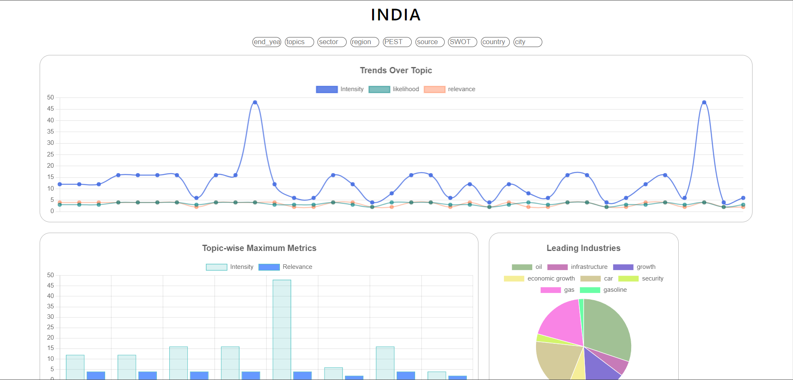

# VisualizeHub: Creative Data Visualization Dashboard
## Overview

Welcome to VisualizeHub, a dynamic Data Visualization Dashboard. This project was crafted to provide an immersive experience using cutting-edge 

technologies and creative visualizations. Utilizing MongoDB for data storage and retrieval working on latest technology MERN Stack.

## Technologies Used

### Front-end:

- React
- React Router
- javascript
- CSS
- Chart.js
- react-scripts

### Back-end:

- Express.js
- Mongoose
- Node.js
- cors

### Database:
 - MongoDB

## Clone the repository:

bash

Copy code

git clone https://github.com/harshKumar029/blackcoffer.git

Navigate to the project directory:

bash

Copy code

cd file dirctory

Install dependencies:

Start the server

open cmd on terminal

backend : nodemon start

frontend: npm start

Open your browser and visit http://localhost:3000 to use the application.

Explore the Dashboard:
    you can use filter to filterout the data based on filter option.